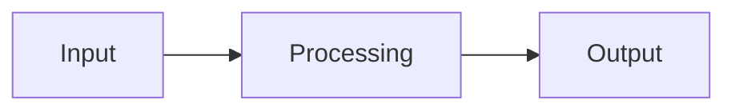

# Phase 4: Design Modes - Research

**Researched:** 2026-03-07
**Domain:** Claude Code subagent architecture for multi-preset design agent (architecture, UI/UX, agent, product)
**Confidence:** HIGH

## Summary

Phase 4 delivers the `signe-designer` agent and `/signe-design` skill. The designer is a single Claude Code subagent that handles four design presets -- architecture, UI/UX, agent design, and product design -- each producing domain-specific structured deliverables. This follows the identical architectural pattern established in Phase 2 (researcher with 4 presets + auto-detect) and Phase 3 (planner with argument routing). The key challenge is that the designer agent must contain four complete design methodologies within a single system prompt, making it significantly larger than previous agents.

The designer agent is the most content-heavy agent in the Signe system. The researcher handles 4 presets but shares a common research methodology across all of them (search, read, score, synthesize). The designer's presets are fundamentally different disciplines -- each with its own methodology, deliverable set, and domain vocabulary. This means the system prompt must be organized to prevent cross-contamination between presets while sharing common design principles (iteration, structured output, user-centered thinking).

**Primary recommendation:** Build two files: `signe/skills/signe-design/SKILL.md` (skill entry point with preset passthrough via `$ARGUMENTS`) and `signe/agents/signe-designer.md` (agent with four methodology sections). Use the researcher's preset-detection pattern (keyword matching + explicit `preset:` prefix). The agent needs Read, Write, Bash, Grep, Glob tools for file operations plus MCP servers for domain-specific capabilities (filesystem for architecture, puppeteer/figma for UI/UX). Target approximately 400-500 lines for the agent definition. Deploy to `~/.claude/` and validate each preset with a real design task.

<user_constraints>
## User Constraints (from CONTEXT.md)

### Locked Decisions
- Single `signe-designer` agent with preset routing (decided in CONTEXT.md)
- All four presets route through a single `/signe-design` skill entry point

### Claude's Discretion
All implementation decisions are deferred to the researcher:
- Agent architecture -- prompt structure, methodology organization, line count, methodology separation strategy
- Tool access per preset -- shared allowlist vs per-preset differentiation, which MCP servers each preset needs
- Output deliverables per preset -- artifact format for each design domain
- Preset routing -- reuse researcher's auto-detect pattern vs explicit prefix vs hybrid
- Skill definition -- SKILL.md structure, context type, argument parsing, preset validation
- Agent definition details -- maxTurns, permissionMode, system prompt structure, memory usage
- Methodology per preset -- design process phases, iteration, output checkpoints
- Cross-preset consistency -- common principles shared vs fully independent methodologies

### Deferred Ideas (OUT OF SCOPE)
None -- discussion stayed within phase scope
</user_constraints>

<phase_requirements>
## Phase Requirements

| ID | Description | Research Support |
|----|-------------|-----------------|
| ARCH-01 | User can invoke system design via `/signe-design` (architecture preset) and Signe spawns `signe-designer` agent | Skill with `context: fork` and `agent: signe-designer` creates the entry point. Preset routing via keyword detection or explicit `preset:architecture` prefix. |
| ARCH-02 | Designer defines component boundaries (name, responsibility, interface, dependencies) | Architecture methodology section produces a Component Boundary Table for each system component. |
| ARCH-03 | Designer documents data flow (input -> processing -> output) for each major flow | Architecture methodology produces Data Flow Diagrams using Mermaid syntax for text-based rendering. |
| ARCH-04 | Designer specifies API contracts (input types, output types, error cases, versioning) | Architecture methodology produces API Contract specifications per component boundary. |
| ARCH-05 | Designer produces technology decision records (ADRs) | Architecture methodology produces ADRs with decision, context, alternatives, rationale, consequences. |
| ARCH-06 | Designer specifies file/folder structure with purpose annotations | Architecture methodology produces annotated directory tree with purpose comments. |
| UIUX-01 | User can invoke UI/UX design via `/signe-design` (UI/UX preset) | Same skill entry point, preset routing detects "UI", "UX", "wireframe", "user flow" keywords. |
| UIUX-02 | Designer maps user flows (entry -> decisions -> outcomes) | UI/UX methodology produces User Flow Maps with decision points and branch outcomes. |
| UIUX-03 | Designer specifies component hierarchy (atomic -> composite -> page) with props/variants | UI/UX methodology produces Component Hierarchy following atomic design levels. |
| UIUX-04 | Designer generates wireframes (HTML or detailed text specs) | UI/UX methodology produces wireframes as detailed text specifications with layout, content, and interaction notes. |
| UIUX-05 | Designer specifies accessibility requirements per component | UI/UX methodology includes WCAG-referenced accessibility checklist per component. |
| AGNT-01 | User can invoke agent design via `/signe-design` (agent preset) | Same skill entry point, preset routing detects "agent", "subagent", "prompt", "skill" keywords. |
| AGNT-02 | Designer generates complete YAML frontmatter agent definitions | Agent methodology produces full frontmatter with all supported fields (name, description, tools, model, permissionMode, maxTurns, skills, memory, hooks, mcpServers). |
| AGNT-03 | Designer applies structured prompt engineering methodology | Agent methodology follows a structured prompt design process: role, context, task, output format, guardrails, examples. |
| AGNT-04 | Designer selects appropriate tools and scopes permissions per agent | Agent methodology includes a tool selection rationale section with allowlist justification. |
| AGNT-05 | Designer packages reusable knowledge as skills with proper frontmatter | Agent methodology produces SKILL.md definitions with correct frontmatter (name, description, context, agent, disable-model-invocation). |
| PROD-01 | User can invoke product design via `/signe-design` (product preset) | Same skill entry point, preset routing detects "product", "feature", "user story", "MVP" keywords. |
| PROD-02 | Designer generates user stories with acceptance criteria | Product methodology produces "As a [persona], I want [action] so that [value]" stories with testable acceptance criteria. |
| PROD-03 | Designer scopes and prioritizes features (MoSCoW) with rationale | Product methodology produces MoSCoW prioritization table with rationale for each priority level. |
| PROD-04 | Designer maps end-to-end user experience across features | Product methodology produces Experience Maps showing user journey across functional milestones. |
</phase_requirements>

## Standard Stack

### Core

| Component | Value | Purpose | Why Standard |
|-----------|-------|---------|--------------|
| Agent definition | `signe-designer.md` | Design agent with YAML frontmatter and 4-preset system prompt | Same pattern as signe-researcher.md -- validated architecture |
| Skill definition | `signe-design/SKILL.md` | User-facing `/signe-design` entry point | Same pattern as signe-research/SKILL.md -- validated architecture |
| Context type | `context: fork` | Isolated context window for design work | Design produces large structured output -- needs dedicated context |
| Model | `model: inherit` | Defer model pinning to Phase 5 | Established decision from Phase 1 (01-02) |
| Memory | `memory: user` | Cross-project design knowledge | Consistent with all Signe agents |
| Permission mode | `permissionMode: bypassPermissions` | Uninterrupted design workflow | Consistent with researcher and planner; no destructive operations |

### Tool Allowlist

| Tool | Purpose | Required? |
|------|---------|-----------|
| Read | Read project files, existing designs, research output | Yes -- all presets need to understand existing context |
| Write | Write design deliverables to disk | Yes -- all presets produce structured output files |
| Bash | File discovery, directory listing, project structure inspection | Yes -- architecture preset needs project exploration |
| Grep | Search project files for patterns, conventions | Yes -- understanding existing codebase patterns |
| Glob | Find files by pattern | Yes -- discover project structure |
| WebSearch | Reference design patterns, accessibility standards, API conventions | Yes -- designer needs external reference material |
| WebFetch | Read design references, WCAG specs, pattern libraries | Yes -- verify design decisions against standards |
| Agent | NOT included | No -- flat orchestrator constraint, subagents cannot spawn subagents |

**MCP servers:**

| Server | Used By | Purpose |
|--------|---------|---------|
| brave-search | All presets | Search for design patterns, standards, references |
| context7 | Architecture, Agent | Library/framework documentation for technology decisions |
| exa | Architecture, Agent | Code examples, GitHub patterns |

**Tool selection rationale:** The designer needs web tools (unlike the planner) because design work requires referencing external standards -- WCAG accessibility guidelines, API design conventions, prompt engineering best practices, Mermaid diagram syntax. The researcher's full MCP server list is overkill (tavily, arxiv not needed for design), but brave-search, context7, and exa provide useful reference capabilities.

### maxTurns Recommendation

**Recommendation:** `maxTurns: 40`

**Rationale:** Design is more tool-intensive than planning but less than research. The designer needs to:
1. Discover project context (3-5 tool calls: Glob + Read)
2. Read existing files and research output (5-10 tool calls)
3. Optionally search for design references (3-5 tool calls for web lookups)
4. Produce design analysis (thinking, minimal tool calls)
5. Write design deliverables -- multiple output files per preset (3-8 Write calls)
6. Output recap to conversation

Total: ~15-30 tool calls plus thinking. 40 turns provides headroom for presets that need more reference lookups (UI/UX checking WCAG, architecture checking API patterns) without risking runaway execution. This sits between the planner (30) and researcher (50).

### Alternatives Considered

| Instead of | Could Use | Tradeoff |
|------------|-----------|----------|
| Single agent with 4 presets | 4 separate agents | Four agents means 4 files to maintain, 4 settings.json entries, 4 deployment steps. Single agent is consistent with researcher pattern and the CONTEXT.md locked decision. |
| Web tools included | No web tools (like planner) | Design benefits from reference material lookup, especially for accessibility standards and API conventions. Worth the extra token cost. |
| `maxTurns: 50` (same as researcher) | Lower (30-35) | 40 is a sweet spot -- design needs more turns than planning (multiple deliverable files) but less than research (no iterative multi-round web searching). |

## Architecture Patterns

### Established File Structure

```
signe/
  agents/
    signe-designer.md       # NEW -- design agent definition (~400-500 lines)
  skills/
    signe-design/
      SKILL.md              # NEW -- skill entry point
  CLAUDE.md                 # UPDATE -- mark Design as Available
  agents/signe.md           # UPDATE -- move /signe-design to Now section
  rules/signe-delegation.md # UPDATE -- mark signe-designer as Available
```

### Pattern 1: Preset-Routing Agent (from signe-researcher.md)

**What:** Single agent handles multiple presets by parsing the first token of `$ARGUMENTS` for an explicit `preset:<name>` prefix, with keyword-based auto-detection as fallback.
**When to use:** Always -- this is the validated pattern from Phase 2.
**Adaptation for design:** The four design presets are more distinct from each other than research presets. Auto-detection keywords are less ambiguous:

| Preset | Explicit Prefix | Auto-Detect Keywords |
|--------|----------------|---------------------|
| architecture | `preset:architecture` | "architecture", "system design", "component", "API", "data flow", "ADR" |
| uiux | `preset:uiux` | "UI", "UX", "wireframe", "user flow", "accessibility", "component hierarchy", "screen" |
| agent | `preset:agent` | "agent", "subagent", "prompt", "skill", "tool allowlist" |
| product | `preset:product` | "product", "feature", "user story", "MVP", "MoSCoW", "experience map", "roadmap" |

**Ambiguity handling:** If keywords from multiple presets match, prefer the first match in priority order: agent > architecture > uiux > product. The reasoning: "agent" is highly specific, "architecture" is moderately specific, "UI/UX" has some overlap with product, and "product" is the broadest catch-all.

If no keywords match, default to `architecture` (the most common design task).

### Pattern 2: Methodology-Per-Preset Organization

**What:** The system prompt is organized into shared sections (identity, argument parsing, output delivery, safety) plus per-preset methodology sections. Each preset methodology is self-contained with its own process steps, deliverable templates, and quality criteria.
**Why:** Prevents cross-contamination between presets. The agent reads only the relevant methodology section for the active preset.

**Prompt structure (recommended):**

```
1. Identity and communication style (10-15 lines)
2. Argument parsing with preset detection (30-40 lines)
3. Shared design principles (15-20 lines)
4. Preset: Architecture methodology (60-80 lines)
5. Preset: UI/UX methodology (60-80 lines)
6. Preset: Agent methodology (60-80 lines)
7. Preset: Product methodology (50-70 lines)
8. Output delivery (write to disk + recap) (30-40 lines)
9. Safety constraints (10-15 lines)
```

**Estimated total: 400-500 lines.** This is larger than the researcher (280 lines) or planner (230 lines) because four distinct methodologies must be encoded. This is acceptable -- the system prompt is self-contained and the agent runs in a forked context with its own context window.

### Pattern 3: Shared Design Principles

**What:** A brief section at the top of the methodology area that applies to ALL presets, establishing common design values.
**Content:**
- **User-centered:** Every design decision traces back to a user need or use case
- **Iterative:** First pass produces structure, second pass adds detail, third pass validates
- **Structured output:** All deliverables use consistent formatting (tables, headings, templates)
- **Traceability:** Each design decision references its rationale (why this, not that)
- **Research integration:** When research output exists, extract and incorporate findings

### Pattern 4: Output Naming Convention

**What:** Each preset produces a file named `signe-design-[preset]-[slugified-topic].md`.
**Examples:**
- `signe-design-architecture-user-auth-system.md`
- `signe-design-uiux-dashboard-redesign.md`
- `signe-design-agent-code-reviewer.md`
- `signe-design-product-mvp-marketplace.md`

This follows the established `signe-[mode]-[topic].md` naming pattern.

### Anti-Patterns to Avoid

- **Monolithic methodology:** Do not write one generic "design process" that all presets share. The four presets are fundamentally different disciplines. Shared principles are brief (15-20 lines), then each preset has its own complete methodology.
- **Tool-heavy design:** The designer should think and structure, not execute. It should NOT attempt to create actual Figma files, run code, or build prototypes. It produces specifications and plans.
- **Unconstrained deliverables:** Each preset must have a fixed deliverable template. Without templates, the designer will produce inconsistent output across invocations.
- **Missing research integration:** Like the planner, the designer should check for existing research output (`signe-research-*.md`) before starting design work. Research findings inform technology decisions (architecture), user insights (UI/UX, product), and existing patterns (agent design).

## Don't Hand-Roll

| Problem | Don't Build | Use Instead | Why |
|---------|-------------|-------------|-----|
| Diagram generation | ASCII art or custom rendering | Mermaid syntax in Markdown | Mermaid renders in most Markdown viewers; ASCII art breaks on different terminals |
| Wireframe creation | HTML files or image generation | Detailed text specifications with layout descriptions | The agent cannot render HTML or create images; text specs are unambiguous and actionable |
| YAML validation | Custom YAML parser in the prompt | Well-defined YAML templates with field-by-field guidance | The agent produces valid YAML by following templates, not by parsing/validating |
| Accessibility auditing | Custom checklist from scratch | Reference WCAG 2.1 AA as the baseline standard | WCAG is the industry standard; building a custom checklist would be incomplete |
| Priority scoring | Numerical scoring algorithms | MoSCoW framework (Must/Should/Could/Won't) | MoSCoW is widely understood, requires rationale, and avoids false precision |

**Key insight:** The designer produces specifications, not implementations. Every deliverable is a structured text document that a human or another agent can act on. The designer never builds the thing it designs.

## Common Pitfalls

### Pitfall 1: Prompt Bloat Leading to Instruction Drift

**What goes wrong:** With 400-500 lines of system prompt, the agent starts ignoring later sections or blending instructions from different presets.
**Why it happens:** Long system prompts dilute attention. Instructions at the end get less adherence than instructions at the beginning.
**How to avoid:** Put the most critical instructions (identity, preset detection, output format) at the TOP of the prompt. Put safety constraints near the top too. Each preset methodology section should start with a clear delimiter (`## Preset: Architecture`) and explicitly state "When this preset is active, follow ONLY these steps."
**Warning signs:** Agent produces architecture deliverables when asked for UI/UX, or mixes deliverable formats.

### Pitfall 2: Vague Deliverable Templates

**What goes wrong:** The agent produces free-form prose instead of structured specifications.
**Why it happens:** Templates are not concrete enough in the system prompt.
**How to avoid:** Include actual template snippets with placeholder values for each deliverable type. The agent should fill in templates, not improvise output format.
**Warning signs:** Deliverables look different every time the same preset is invoked.

### Pitfall 3: Over-Specifying vs Under-Specifying

**What goes wrong:** Architecture preset produces exhaustive detail for a small project, or minimal detail for a complex system.
**Why it happens:** No guidance on scaling depth to project complexity.
**How to avoid:** Include scope-sensing instructions: "For simple systems (1-3 components), produce concise specifications. For complex systems (10+ components), focus on the most critical components first and note which components need deeper design."
**Warning signs:** 50-page design for a TODO app, or 1-page design for a distributed system.

### Pitfall 4: Agent Preset Producing Invalid YAML

**What goes wrong:** The agent design preset generates YAML frontmatter that doesn't match Claude Code's supported fields.
**Why it happens:** The agent invents fields or uses incorrect syntax.
**How to avoid:** Include the complete list of supported frontmatter fields in the agent preset methodology section (name, description, tools, disallowedTools, model, permissionMode, maxTurns, skills, mcpServers, hooks, memory, background, isolation). Reference the official Claude Code docs.
**Warning signs:** Generated agent definitions include unsupported fields like `temperature`, `contextLength`, or `priority`.

### Pitfall 5: Missing the Recap

**What goes wrong:** The agent writes deliverables to disk but doesn't produce a conversational recap.
**Why it happens:** Write tool call is the last action; agent doesn't return summary text.
**How to avoid:** Explicitly instruct: "After writing all deliverable files, output a recap to the conversation" with a template. This matches the researcher and planner patterns.
**Warning signs:** User sees "file written" but no summary of what was designed.

## Code Examples

Verified patterns from the existing codebase (HIGH confidence -- directly from deployed files):

### Agent YAML Frontmatter (recommended for signe-designer)

```yaml
---
name: signe-designer
description: Multi-preset design agent. Produces structured design deliverables for system architecture, UI/UX, agent design, and product design.
tools: Read, Write, Bash, Grep, Glob, WebSearch, WebFetch
mcpServers: brave-search, context7, exa
model: inherit
memory: user
maxTurns: 40
permissionMode: bypassPermissions
---
```

### Skill YAML Frontmatter (recommended for signe-design/SKILL.md)

```yaml
---
name: signe-design
description: Structured design with four presets -- architecture, UI/UX, agent, product
context: fork
agent: signe-designer
disable-model-invocation: false
---
```

### Skill Body Pattern

```markdown
## Design Task

Create a structured design for the following topic using the appropriate preset.

$ARGUMENTS

If the first token starts with `preset:`, use that preset's methodology.
Otherwise, auto-detect the best preset based on the topic.

Available presets: architecture, uiux, agent, product.

Before designing, check the current directory for research output files
(signe-research-*.md) and incorporate their findings into your design.

Produce structured design deliverables and write them to disk.
```

### Preset Detection Pattern (from signe-researcher.md, adapted)

```markdown
## Argument Parsing

Your task prompt contains the design topic passed via `$ARGUMENTS`.

**Preset detection:**
1. If the first token matches `preset:<name>`, extract the preset and treat the rest as the topic.
2. Valid presets: `architecture`, `uiux`, `agent`, `product`.
3. If no explicit preset, auto-detect:
   - "architecture", "system design", "component", "API", "data flow", "ADR" -> `architecture`
   - "UI", "UX", "wireframe", "user flow", "accessibility", "screen" -> `uiux`
   - "agent", "subagent", "prompt", "skill", "tool allowlist" -> `agent`
   - "product", "feature", "user story", "MVP", "MoSCoW" -> `product`
   - Otherwise -> `architecture` (default)
```

### Architecture Deliverable Template (recommended)

```markdown
# Architecture Design: [Topic]

**Date:** [YYYY-MM-DD]
**Preset:** architecture

## Component Boundaries

| Component | Responsibility | Interface | Dependencies |
|-----------|---------------|-----------|-------------|
| [name] | [what it does] | [how others interact with it] | [what it needs] |

## Data Flows

### [Flow Name]

**Format:** [JSON/protobuf/etc]
**Protocol:** [HTTP/gRPC/etc]

## API Contracts

### [Endpoint/Interface Name]
- **Input:** [type definition]
- **Output:** [type definition]
- **Errors:** [error cases]
- **Versioning:** [strategy]

## Architecture Decision Records

### ADR-001: [Decision Title]
- **Decision:** [what was decided]
- **Context:** [why this decision was needed]
- **Alternatives:** [what else was considered]
- **Rationale:** [why this option was chosen]
- **Consequences:** [what this means going forward]

## File/Folder Structure

```
src/
  [folder]/     # [purpose]
  [folder]/     # [purpose]
```
```

### Agent Preset Deliverable Template (recommended)

```markdown
# Agent Design: [Topic]

**Date:** [YYYY-MM-DD]
**Preset:** agent

## Agent Definition

```yaml
---
name: [agent-name]
description: [when to invoke this agent]
tools: [tool list]
model: [model]
memory: [scope]
maxTurns: [number]
permissionMode: [mode]
---
```

## System Prompt Structure

### Role Definition
[Who the agent is, communication style]

### Context Injection
[What context the agent receives, how it discovers project state]

### Task Methodology
[Step-by-step process the agent follows]

### Output Format
[Templates for agent output]

### Guardrails
[Safety constraints, what the agent must NOT do]

## Tool Selection Rationale

| Tool | Included? | Rationale |
|------|-----------|-----------|
| [tool] | Yes/No | [why] |

## Skill Definitions

### [Skill Name]
```yaml
---
name: [skill-name]
description: [what the skill does]
context: [fork/inline]
agent: [agent-name]
---
```
```

### Output File Naming Pattern

```
signe-design-[preset]-[slugified-topic].md
```

Examples:
- `signe-design-architecture-payment-gateway.md`
- `signe-design-uiux-onboarding-flow.md`
- `signe-design-agent-data-pipeline-monitor.md`
- `signe-design-product-saas-dashboard-mvp.md`

### Recap Pattern (consistent with researcher and planner)

```markdown
## Design: [Topic]

**Preset:** [preset] | **Deliverables:** [count]

### Key Design Decisions
- [Decision 1 with rationale]
- [Decision 2 with rationale]

### Deliverables Produced
1. [Deliverable 1] -- [brief description]
2. [Deliverable 2] -- [brief description]

### Open Questions
- [Question requiring user input, if any]

---
Full design: `[file path]`
```

## State of the Art

| Old Approach | Current Approach | When Changed | Impact |
|--------------|------------------|--------------|--------|
| Separate agents per design domain | Single multi-preset agent | Established in Phase 2 (researcher) | Reduces maintenance, consistent routing |
| Free-form design output | Template-driven structured deliverables | Standard practice | Reproducible, parseable output |
| Mermaid for diagrams | Mermaid for diagrams (unchanged) | Stable | Text-based, renders in most Markdown viewers |
| Custom accessibility checklists | WCAG 2.1 AA as baseline | WCAG standard | Industry-standard, comprehensive |

**Relevant to this implementation:**
- Claude Code's official docs confirm all YAML frontmatter fields: name, description, tools, disallowedTools, model, permissionMode, maxTurns, skills, mcpServers, hooks, memory, background, isolation. The agent design preset should reference this complete field list.
- The `skills` frontmatter field injects full skill content at startup. The agent design preset should be aware of this when designing agents with preloaded skills.
- Subagents cannot spawn other subagents -- this is enforced architecturally. The agent design preset must include this as a constraint when designing agent hierarchies.

## Supported YAML Frontmatter Fields (for Agent Preset)

The agent design preset must know the complete list of supported fields to produce valid agent definitions. From the official Claude Code documentation:

| Field | Required | Description |
|-------|----------|-------------|
| `name` | Yes | Unique identifier, lowercase letters and hyphens |
| `description` | Yes | When Claude should delegate to this subagent |
| `tools` | No | Allowlist of available tools. Inherits all if omitted |
| `disallowedTools` | No | Denylist, removed from inherited/specified list |
| `model` | No | `sonnet`, `opus`, `haiku`, or `inherit`. Default: `inherit` |
| `permissionMode` | No | `default`, `acceptEdits`, `dontAsk`, `bypassPermissions`, `plan` |
| `maxTurns` | No | Maximum agentic turns before stop |
| `skills` | No | Skills to preload into context at startup |
| `mcpServers` | No | MCP servers available to agent |
| `hooks` | No | Lifecycle hooks scoped to agent |
| `memory` | No | `user`, `project`, or `local` persistence |
| `background` | No | Run as background task (default: false) |
| `isolation` | No | `worktree` for isolated git worktree |

## Open Questions

1. **System prompt line count**
   - What we know: The researcher is 280 lines with 4 similar presets sharing a common methodology. The designer has 4 fundamentally different methodologies.
   - What's unclear: Whether 400-500 lines will cause instruction adherence degradation in Claude.
   - Recommendation: Build at 400-500 lines. If testing reveals instruction drift (mixing presets, ignoring later sections), split into tighter per-preset instructions with stronger delimiter markers. Monitor during human validation.

2. **UI/UX wireframe format**
   - What we know: CONTEXT.md mentions "HTML or text specs" for wireframes. The agent cannot preview HTML or create images.
   - What's unclear: Whether users expect actual renderable HTML or just structured text descriptions.
   - Recommendation: Use detailed text specifications (layout grid, content blocks, interaction notes, responsive breakpoints). This is unambiguous, actionable, and doesn't depend on rendering capabilities. Note: the agent CAN produce HTML if explicitly asked, but the default should be text specs.

3. **Mermaid diagram complexity**
   - What we know: Mermaid syntax works in most Markdown renderers and is text-based.
   - What's unclear: How complex the data flow diagrams should be (simple flowcharts vs. sequence diagrams vs. class diagrams).
   - Recommendation: Default to `graph LR/TD` for component flows and `sequenceDiagram` for interaction flows. Avoid class diagrams and state diagrams unless the topic specifically calls for them.

## Validation Architecture

### Test Framework

| Property | Value |
|----------|-------|
| Framework | Manual end-to-end validation |
| Config file | None -- validation is human-driven invocation |
| Quick run command | `/signe-design preset:architecture Design the auth system for a SaaS app` |
| Full suite command | Run each preset + verify deliverable structure per preset |

### Phase Requirements to Test Map

| Req ID | Behavior | Test Type | Automated Command | File Exists? |
|--------|----------|-----------|-------------------|-------------|
| ARCH-01 | `/signe-design` with architecture preset spawns designer | smoke / manual | Invoke `/signe-design preset:architecture [topic]` and verify agent spawns | Wave 0 |
| ARCH-02 | Output contains Component Boundaries table | manual | Check output file has Component Boundaries section with table | Wave 0 |
| ARCH-03 | Output contains Data Flow diagrams | manual | Check output has Data Flows section with Mermaid syntax | Wave 0 |
| ARCH-04 | Output contains API Contracts | manual | Check output has API Contracts with input/output/error types | Wave 0 |
| ARCH-05 | Output contains ADRs | manual | Check output has ADR section with decision/context/alternatives/rationale | Wave 0 |
| ARCH-06 | Output contains file/folder structure | manual | Check output has annotated directory tree | Wave 0 |
| UIUX-01 | `/signe-design` with UI/UX preset works | smoke / manual | Invoke `/signe-design preset:uiux [topic]` | Wave 0 |
| UIUX-02 | Output contains user flow maps | manual | Check output has User Flows section | Wave 0 |
| UIUX-03 | Output contains component hierarchy | manual | Check output has atomic/composite/page hierarchy | Wave 0 |
| UIUX-04 | Output contains wireframe specs | manual | Check output has wireframe text specifications | Wave 0 |
| UIUX-05 | Output contains accessibility requirements | manual | Check output references WCAG and specifies a11y per component | Wave 0 |
| AGNT-01 | `/signe-design` with agent preset works | smoke / manual | Invoke `/signe-design preset:agent [topic]` | Wave 0 |
| AGNT-02 | Output contains valid YAML frontmatter | manual | Check generated agent definition has valid YAML with supported fields | Wave 0 |
| AGNT-03 | Output follows structured prompt methodology | manual | Check system prompt has role/context/task/output/guardrails sections | Wave 0 |
| AGNT-04 | Output includes tool selection with rationale | manual | Check output has tool allowlist table with justification | Wave 0 |
| AGNT-05 | Output includes skill definitions | manual | Check output has SKILL.md with proper frontmatter | Wave 0 |
| PROD-01 | `/signe-design` with product preset works | smoke / manual | Invoke `/signe-design preset:product [topic]` | Wave 0 |
| PROD-02 | Output contains user stories | manual | Check output has user stories in standard format with acceptance criteria | Wave 0 |
| PROD-03 | Output contains MoSCoW prioritization | manual | Check output has MoSCoW table with rationale | Wave 0 |
| PROD-04 | Output contains experience map | manual | Check output has end-to-end experience map with milestones | Wave 0 |

### Sampling Rate

- **Per task commit:** Verify file structure and frontmatter validity
- **Per wave merge:** Run `/signe-design` with one preset and inspect output
- **Phase gate:** Full end-to-end validation with ALL FOUR presets before `/gsd:verify-work`

### Wave 0 Gaps

- No automated test infrastructure needed -- follows established manual e2e pattern from Phase 1, 2, and 3
- The deployment and validation plan handles live testing for each preset

## Sources

### Primary (HIGH confidence)

- Official Claude Code subagent docs at `https://code.claude.com/docs/en/sub-agents` -- Complete YAML frontmatter field reference, tool allowlists, permission modes, memory scopes, hooks
- Deployed `signe-researcher.md` (280 lines) -- Reference pattern for multi-preset agent with keyword auto-detection
- Deployed `signe-planner.md` (231 lines) -- Reference pattern for argument routing and methodology-embedded agent
- Deployed `signe-research/SKILL.md` and `signe-plan/SKILL.md` -- Reference patterns for skill entry points
- Deployed `signe.md` -- Orchestrator with Available/Coming Soon sections
- Deployed `signe-delegation.md` -- Routing table with status conventions
- `.planning/REQUIREMENTS.md` -- ARCH-01 through PROD-04 requirement definitions
- `.planning/phases/04-design-modes/04-CONTEXT.md` -- User decisions and implementation discretion areas

### Secondary (MEDIUM confidence)

- `https://github.com/shanraisshan/claude-code-best-practice` (via DeepWiki) -- Command -> Agent -> Skill architecture, feature-specific agent design recommendations
- `https://github.com/VoltAgent/awesome-claude-code-subagents` -- Design-related subagent patterns (ui-designer, ux-researcher, api-designer, architect-reviewer)
- Phase 2 and Phase 3 research and plans -- Deployment patterns, integration update procedures

### Tertiary (LOW confidence)

None -- all findings derived from primary or verified secondary sources.

## Metadata

**Confidence breakdown:**
- Standard stack: HIGH -- identical architecture to Phase 2/3, all frontmatter fields verified against official docs
- Architecture: HIGH -- follows established preset-routing pattern, adapted with validated components
- Pitfalls: MEDIUM -- prompt bloat concern is theoretical (untested at 400-500 lines), but mitigated by clear section delimiters
- Deliverable templates: HIGH -- templates are concrete and based on established domain practices (ADRs, MoSCoW, WCAG, Claude Code YAML)

**Research date:** 2026-03-07
**Valid until:** 2026-04-07 (stable -- Claude Code agent architecture is not changing rapidly)
